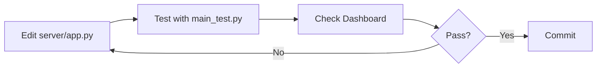
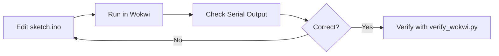

# Development Workflow

## Server Development

### Steps
1. Edit Flask server (`server/app.py`)
2. Restart server process
3. Run `python server/main_test.py`
4. Check response code and Dashboard
5. Check SQLite data: `sqlite3 iot_security.db "SELECT * FROM telemetry"`

## Wokwi Development

### Steps
1. Edit firmware (`wokwi/sketch.ino`)
2. Open `wokwi/` in Wokwi online simulator
3. Monitor Serial output for Beacon/ACK flow
4. Verify with `python server/verify_wokwi.py`

## Pair Programming (Hoàng + Quân)
- **Hoàng (Hardware):** sketch.ino, wokwi/, LoRa, GPS, sensors
- **Quân (System):** server/, docs/, encryption, database, map

## Branch Strategy
- `main` — stable, reviewed
- `feature/*` — individual features
